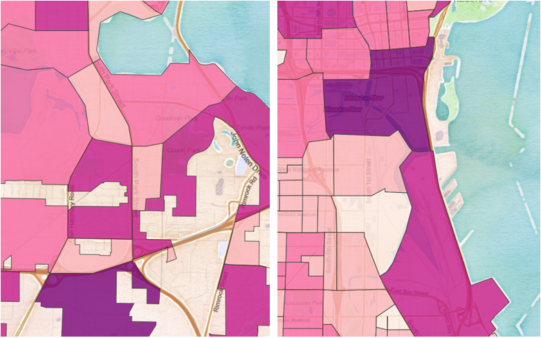

## Portfolio

---
### [Decolonizing Conservation in East Africa](https://arcg.is/1yuHj9)
Investigating how colonialism, militarization, and activism interact in the contemporary conservation landscape.

---
<!-- ### [Amenities in Salt Lake County, UT](400_final_project_Salt_Lake/Salt_Lake_Amenities.md)
Finding and navigating light rail, parks, and food stores in Salt Lake County, Utah.
 -->

---
### [Comparing Madison and Milwaukee, Wisconsin](486_Project_3_Comparing_Wisconsin_cities/Madison_Milwaukee_comparison.md)
Comparing population, income, race, and enthinicty between two cities. Designed in QGIS and hosted on the web by Leaflet.

---
### [COVID-19 Related Twitter Activity in Late March, 2020](486_Lab6/covid_worker_market_tweets.md)
Compiled tweets mentioning COVID-19, as well as compared tweets mentioning markets to those mentioning workers.

---
### [Health Services in West Virginia](project1_486/West_Virginia_Health.md)
Examined the access to health services in West Virginia, including an in-depth look at hospitals in Charleston.

---
### [Undergraduate Research - Andros](Andros_SURF_project.md)
Plotted spatial distribution of forest fires on Andros, and compared temporal distribution to annual climatic patterns.

---
### [Bahama Oriole Project Map](BAHO_map_project.md)
Developed and updated map used for in-field navigation, radio-tracking, and camera traps.
[<image src="images/BAHO_worksite_map.PNG?raw=true"/>](BAHO_map_project.md)

### [Study Abroad Research - Kenya](Kenya_DR_project.md)
Conducted interviews on climate change perceptions and adaptations among rural households in Kenya
[<image src="images/Gabe_presenting_DR_Kenya.PNG?raw=true"/>](Kenya_DR_project.md)

---
### [Median Housing Prices in Pittsburgh, PA](Pittsburgh_webmap/qgis2web_2020_02_18-15_04_22_627169/index.html)
Map of median home sale price of Pittsburgh neighborhoods. Made on QGIS and hosted on Leaflet
[<image src="images/webmap_thumbnail_transparent.PNG?raw=true"/>](Pittsburgh_webmap/qgis2web_2020_02_18-15_04_22_627169/index.html)

---
### Additional Projects

- [Lab for Introductory GIS Course](pdf/Wilkins_Lab_12.pdf)

---

---

Page template forked from <a href="https://github.com/evanca/quick-portfolio">evanca</a>

<!-- Remove above link if you don't want to attibute -->
